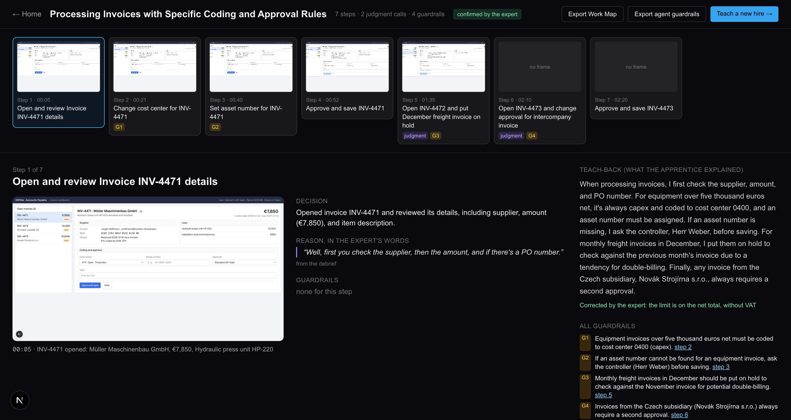
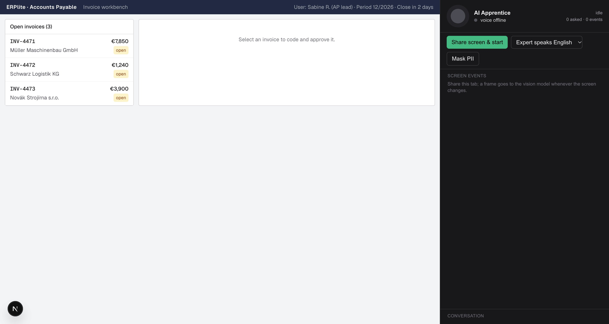
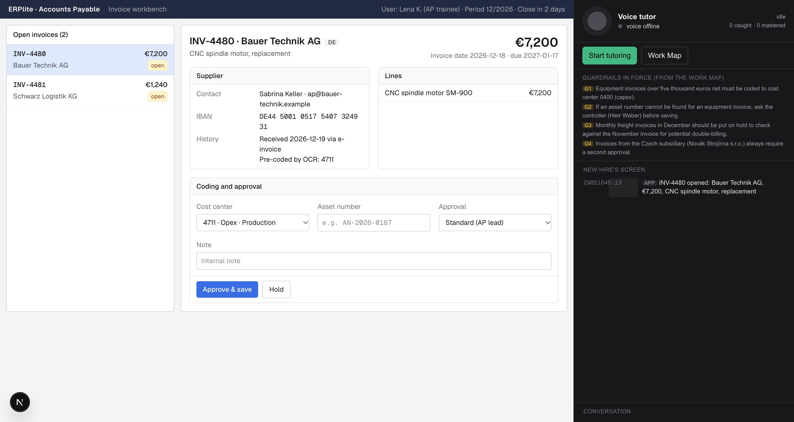

<p align="center">
  
</p>

<h1 align="center">AI Apprentice</h1>

<p align="center">
  A voice apprentice that watches how an expert really works, asks <em>why</em> at the right pause,<br>
  maps the judgment with its guardrails, and teaches the next hire on a case the expert never showed.
</p>

<p align="center">
  <a href="https://ai-apprentice-nu.vercel.app"><b>Live demo</b></a> ·
  <a href="docs/demo-script.md">Demo script</a> ·
  <a href="docs/pitch.md">Pitch &amp; moonshot</a> ·
  <a href="https://ai-apprentice-nu.vercel.app/architecture">Architecture page</a> ·
  Hack-Nation 7 · Challenge 01 (ElevenLabs) · Team SuperDuper
</p>

---

## The problem in one scene

Sabine has run accounts payable for 24 years. She moves one invoice to capex without a word, holds a second
because that supplier double-bills every December, routes a third to the controller because it comes from the
Czech subsidiary. Lena, who started on Monday, catches half of it. Sabine retires in 18 months.

Screen recordings capture *what* she clicked. Nobody captured *why*.

## What the apprentice does

| | Module | What happens | Brief requirement |
|---|---|---|---|
| 1 | **Capture** `/capture` | Sabine shares her tab. Every 1.5 s a frame is pixel-diffed; only changes go to the vision model, which returns **events, not video** (PII masked). The ElevenLabs agent stays silent while she types and asks one question at a pause: *"You moved that one to capex. What made you do that?"* | ≥3 questions at natural pauses, ≥1 about a guardrail ✓ |
| 2 | **Map** `/map` | *"I'm done"* → a schema-guided reasoning pass turns events + transcript into a draft Work Map and a list of open gaps. The agent runs a spoken **debrief**: ≥3 gap questions, then explains the whole process back; Sabine corrects one detail and confirms. Every step links a screen moment, the decision, her quote and the guardrails. | ≥3 follow-ups, teach-back the expert confirms ✓ |
| 3 | **Teach** `/teach` | Lena opens **INV-4480**, a case Sabine never saw, and reaches for opex. The tutor asks her to predict, then **pauses the save**: *"Sabine would stop here. Why do you think?"*, replays Sabine's screen moment and quote, records what Lena mastered and what to practice. | Catches ≥1 wrong decision before it is saved ✓ |

<p align="center">
  
  
</p>

## The Apprentice Test

| Question | Our answer |
|---|---|
| **When to ask** | A client-side pause gate: no keys or mouse for 3 s, no speech (VAD), agent not speaking, ≥40 s since the last question, something new on screen, budget 3–5 questions per 10 min. The agent may still `skip_turn`. |
| **What to ask** | Screen events arrive as context the agent must not answer. The prompt forbids asking what the screen shows and ranks reason > limit > exception > stop-and-ask. Unasked events roll into the debrief. |
| **When it has understood** | The Work Map synthesis lists open gaps. The debrief ends only after ≥3 gaps and a teach-back confirmed via `confirm_teachback`; corrections are folded back into the map. |
| **Whether the new hire learned** | A case never shown, prediction questions, guardrail interception before save, `record_mastery` per step → mastered / practice summary. |
| **Trust** | `off_the_record` (tool and button) strikes the last 60 s. Vision returns `[PERSON]`, `[IBAN]`, `[EMAIL]` instead of personal data; an on-screen mask blurs it before capture. Frames and the session stay in the browser (IndexedDB). |

## How it works

```
 browser                                   server (Next.js route handlers, Effect 4)
 ┌─────────────────────────────┐           ┌──────────────────────────────────────────┐
 │ /erp  sandbox AP workbench  │ postMessage│                                          │
 │   (iframe, invented data)   ├──────────▶│                                          │
 │                             │           │  /api/vision   prev+curr frame ──▶ Gemini │
 │ getDisplayMedia ─▶ 64×36    │  changed  │                 ◀── events, PII masked    │
 │   grayscale diff ≥1.2 %     ├──────────▶│                                          │
 │                             │           │  /api/workmap  events + transcript ──▶    │
 │ pause gate ──▶ [PAUSE]      │           │     SGR cascade (Effect Schema → JSON     │
 │ events ─────▶ [SCREEN]      │           │     Schema → constrained decoding):       │
 │        ▼                    │           │     observations → step boundaries →      │
 │ ElevenLabs agent (WebSocket)│           │     quotes → guardrail evidence → map     │
 │   one agent, three prompts: │           │                                          │
 │   interviewer · debrief ·   │           │  /api/agent/token  signed URL            │
 │   tutor (overrides)         │           └──────────────────────────────────────────┘
 │   client tools: off_the_    │
 │   record, end_task, confirm_│   Work Map JSON ──▶ tutor prompt
 │   teachback, replay_moment, │                ──▶ guardrail checker (when → must) on the new hire's ERP state
 │   record_mastery            │                ──▶ agent-guardrails.json export
 └─────────────────────────────┘
```

**Guardrails are machine-checkable.** The synthesis emits each rule twice: in Sabine's words and as a check,
e.g. `when amount > 5000 → must cost_center = 0400`. The same JSON drives the tutor's interception and exports as
instructions an agent can load, so an automation stops exactly where Sabine would.

## Tested without a microphone

`pnpm eval` drives the **real** ElevenLabs agent over a text-only WebSocket with a Gemini-played expert and
scripted screen events, then checks the brief's requirements as invariants. The last run: **23/23**.

```
[capture]  ✓ ≥3 questions at pauses (4)  ✓ ≥1 about a guardrail  ✓ off_the_record  ✓ end_task  ✓ never asks what the screen shows
[workmap]  ✓ 4–9 steps  ✓ every step has a frame  ✓ ≥3 guardrails (4)  ✓ ≥2 machine-checkable  ✓ quotes verbatim  ✓ off-the-record absent
[debrief]  ✓ ≥3 follow-ups  ✓ teach-back  ✓ confirm_teachback {confirmed: true, corrections: "net total, without VAT"}
[teach]    ✓ checker flags the wrong decision  ✓ tutor steps in before the save  ✓ replay_moment  ✓ record_mastery  ✓ quotes the expert
```

The eval also writes `public/demo-session.json` (real frames, events, transcript, confirmed Work Map), which
`/map` and `/teach` load as a fallback when no capture session exists.

## Stack

Next.js 16 · ElevenLabs Agents (`@elevenlabs/react`, `eleven_v3_conversational`, Expressive Mode, patient turn-taking,
client tools, per-session prompt overrides) · Gemini 2.5 Flash for vision and synthesis · **Effect 4** for the server
pipeline (typed errors, retry, timeout, key rotation) · Effect Schema for the SGR schemas · IndexedDB for the session.

## Run it

```bash
cd app
pnpm install
cp .env.example .env.local        # GEMINI_API_KEY, ELEVENLABS_API_KEY
pnpm agent:create                 # creates the ElevenLabs agent (tools, overrides), writes ELEVENLABS_AGENT_ID
pnpm dev                          # http://localhost:3000
pnpm eval -- --write-demo         # full text-mode run against the real agent; writes the demo session
```

Open `/capture`, share **this tab**, and follow [`docs/demo-script.md`](docs/demo-script.md).

## Repository layout

```
app/src/app/erp         sandbox AP workbench (iframe); mirrors field changes and activity to the parent
app/src/app/capture     module 1+2: screen watch, pause gate, agent session, debrief flow
app/src/app/map         Work Map timeline, exports
app/src/app/teach       tutor, guardrail interception, mastery summary
app/src/app/architecture  one-page technical walkthrough
app/src/server          Effect pipeline: llm.ts (structured generation), vision.ts, workmap.ts (SGR cascade)
app/src/lib             Effect Schema models, frame capture + diff, guardrail checker, prompts
app/scripts             create-agent.ts, eval.ts (text-only harness), deploy.sh
app/eval/cases          scripted expert sessions with expected invariants
docs/                   challenge brief, demo script, pitch, plan
demo/video              submission videos and the slides they were cut from
```

## Moonshot

One expert, one task, one new hire today. Next: the apprentice runs in the background of everyday work, already
holding the Work Map, and speaks only when a case does not match any rule, one question at the pause. Every answer
updates the map; the map's guardrails let agents take the routine steps while people keep the judgment calls.
Our first field is AV operations and sales desks at Epiphan Video, where a real-time coaching assistant already
listens to calls and reads the screen; what it lacked was a source of rules. The apprentice is that source.

Team SuperDuper: Rustam Salavatov (build) and Azaliya Salavatova (marketing, testing: she played the new hire).
MIT License.
